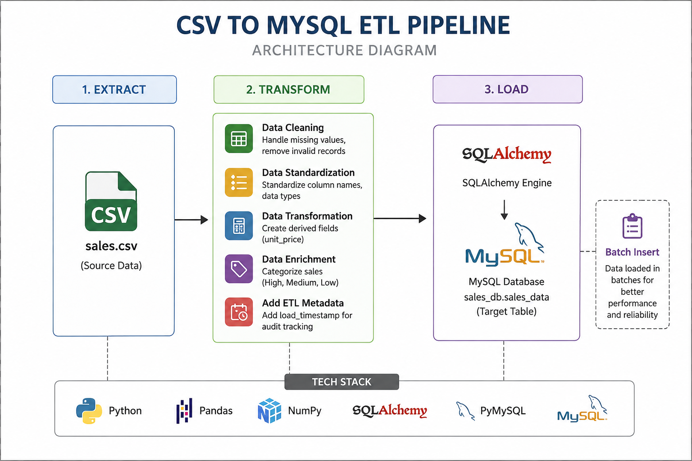

# CSV to MySQL ETL Pipeline

## Overview

This project implements an ETL (Extract, Transform, Load) pipeline that reads sales data from a CSV file, performs data cleaning and transformation, and loads the processed data into a MySQL database using SQLAlchemy.

## Architecture



### ETL Workflow

```text
CSV File
    │
    ▼
Extract Data (Pandas)
    │
    ▼
Transform Data
├── Clean Data
├── Standardize Columns
├── Convert Data Types
├── Create Derived Fields
├── Categorize Sales
└── Add ETL Timestamp
    │
    ▼
Load Data (SQLAlchemy + PyMySQL)
    │
    ▼
MySQL Database
```

## Technologies Used

* Python
* Pandas
* NumPy
* SQLAlchemy
* PyMySQL
* MySQL

## Features

* Automated CSV ingestion
* Data cleaning and validation
* Sales categorization
* Batch data loading
* MySQL integration
* ETL audit tracking
* Scalable ETL architecture

```
```
